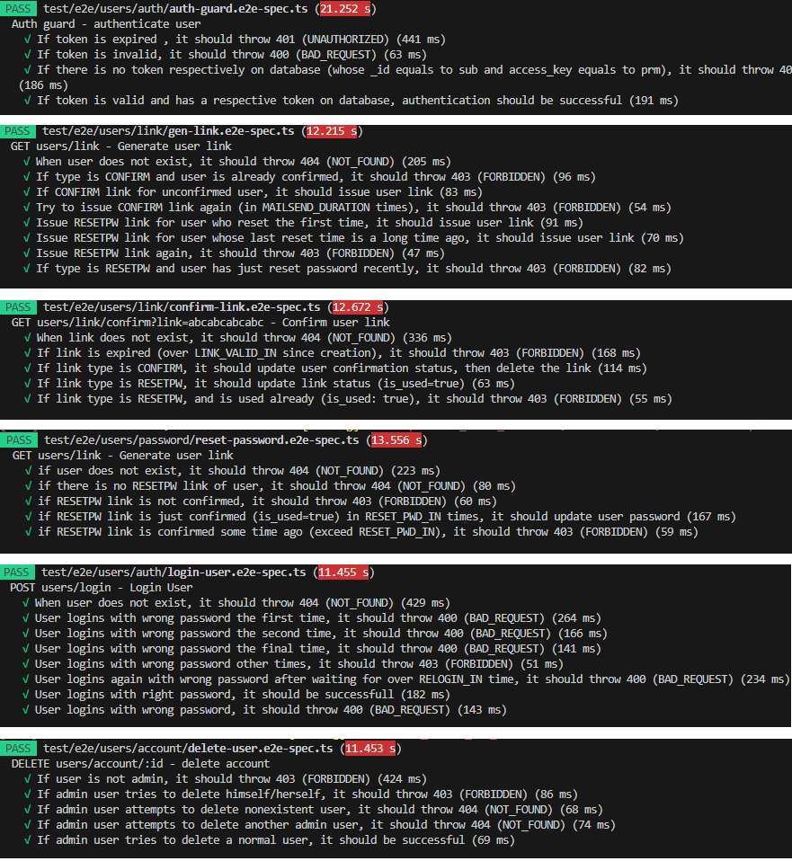

<h2 align="center">Microservices Architecture with NestJs</h2>
  
<h3 align="center">Building a simple microservices-based backend application</h3>

This project is inspired by Mr.Pvarentsov's repository named [NestJs-microservices-example](https://github.com/Denrox/nestjs-microservices-example)

## About Microservices Architecture

Microservices is a trending architecture that is highly adopted for building big application. It offers great flexibility, scalability, and cost efficiency in software development

A microservices-based application consists of many independent services (microservices). Each service runs on different process (port), should have only one concern and will be assigned for a developer team to work on independently. The team therefor can freely improve their service quality with greater efficiency and resouce concentration.
With common services like authentication, media storage, mailer,... we can consider to rent from a service provider instead of building them from scratch. So that we can focus on developing our app main characteristics

 
### Microservices in this project
##### In this project, there are 4 services (microservices): 

 &nbsp;&nbsp;&nbsp;&nbsp;&nbsp;&nbsp;&nbsp;&nbsp;&nbsp;&nbsp;&nbsp;&nbsp;&nbsp;&nbsp;&nbsp;&nbsp;&nbsp;&nbsp;&nbsp;&nbsp;&nbsp;&nbsp;&nbsp;&nbsp;&nbsp;&nbsp;&nbsp;&nbsp;&nbsp;&nbsp;&nbsp;&nbsp;&nbsp;&nbsp;&nbsp;&nbsp;&nbsp;&nbsp;&nbsp;&nbsp;&nbsp;&nbsp;&nbsp;&nbsp;&nbsp;&nbsp;&nbsp;&nbsp;&nbsp;&nbsp;&nbsp;&nbsp;&nbsp;&nbsp;&nbsp;> **Mail Service**\
&nbsp;&nbsp;&nbsp;&nbsp;&nbsp;&nbsp;&nbsp;&nbsp;&nbsp;&nbsp;&nbsp;&nbsp;&nbsp;&nbsp;&nbsp;&nbsp;&nbsp;&nbsp;&nbsp;&nbsp;&nbsp;&nbsp;> **User Service**  __/        
**Gateway**  __/&nbsp;&nbsp;&nbsp;&nbsp;&nbsp;&nbsp;&nbsp;&nbsp;&nbsp;&nbsp;&nbsp;&nbsp;&nbsp;&nbsp;&nbsp;&nbsp;&nbsp;&nbsp;&nbsp;&nbsp;&nbsp;&nbsp;&nbsp;&nbsp;&nbsp;&nbsp;&nbsp;&nbsp;&nbsp;&nbsp;&nbsp;\\                   
&nbsp;&nbsp;&nbsp;&nbsp;&nbsp;&nbsp;&nbsp;&nbsp;&nbsp;&nbsp;&nbsp;&nbsp;&nbsp;&nbsp;&nbsp;&nbsp;&nbsp;&nbsp;&nbsp;&nbsp;\\&nbsp;&nbsp;&nbsp;&nbsp;&nbsp;&nbsp;&nbsp;&nbsp;&nbsp;&nbsp;&nbsp;&nbsp;&nbsp;&nbsp;&nbsp;&nbsp;&nbsp;&nbsp;&nbsp;&nbsp;&nbsp;&nbsp;&nbsp;&nbsp;&nbsp;&nbsp;&nbsp;&nbsp;&nbsp;&nbsp;&nbsp;&nbsp;&nbsp;> **Token Service**\
&nbsp;&nbsp;&nbsp;&nbsp;&nbsp;&nbsp;&nbsp;&nbsp;&nbsp;&nbsp;&nbsp;&nbsp;&nbsp;&nbsp;&nbsp;&nbsp;&nbsp;&nbsp;&nbsp;&nbsp;&nbsp;&nbsp;> **Task Service**

- **Mail Service** is used by **User Service**, it provides sending email service, specifically sending account confirm link and reset password link to users 

- **Token Service** is used by **User Service**, it provides authentication-related services like encode, decode web token

- **User Service** provider user-related services like user authentication, user profile, credentials updation,..etc. This service is used by Gateway to fulfill User Controller.

- **Task Service** provides task-related services like CRUD operations on user tasks. This service is used by Gateway to fulfill Task Controller

**Gateway** is our application that exposes two controllers (**User Controller and Task Controller**). It uses two respective Client Services (**User Service and Task Service**) to accomplish its controllers use cases. **Gateway** communicates with its Client Services through **Client Proxies** 

Note that a service (microsevice) can implement the domain on its own. But it can also wrap an **External Service** instead for that purpose.  

## Project highlights

1. **NestJs** as backend framework
2. **MongoDB** as database
3. **Jest** for integration testing
4. **JWT** authentication, Role-based authorization
5. **Class-validator, Class-transformer** for validation
6. **Swagger** as api documentation

## Routes
Here is the list of routes (use cases):
**User controller**

 
    

**Task controller**

 
    

## Tests
I used [Jest](https://jestjs.io/) to write some integration tests

 
    

## Thank you
Thank you for reading this. I hope you can learn something from this project. It is good for NestJs starter. Wish you all the best with your developer journey!